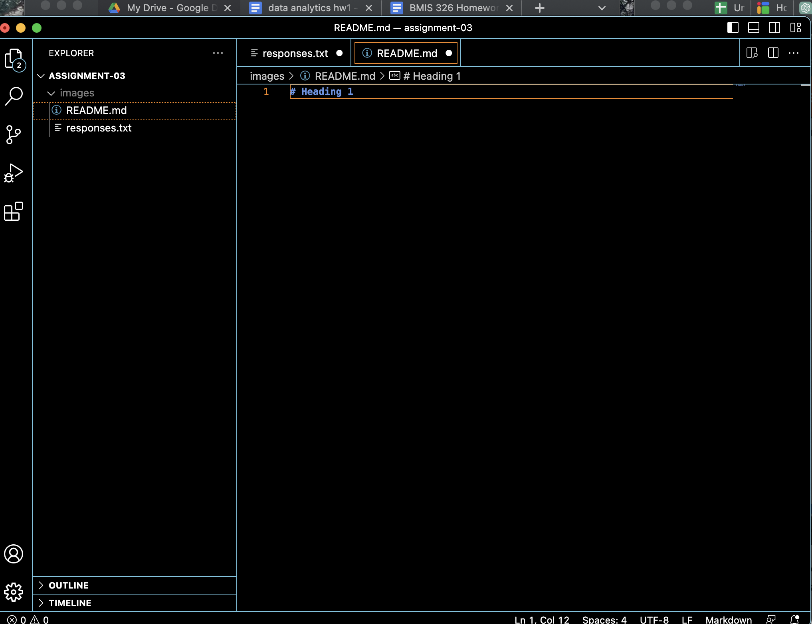

# Heading 1

1. I have learned how to create a directory on GITHUB, I have learned how to navigate Visual Studio Code, and I have learned how IP addresses are made from domain names.

[google](https://google.com)

[images](./responses.txt)

