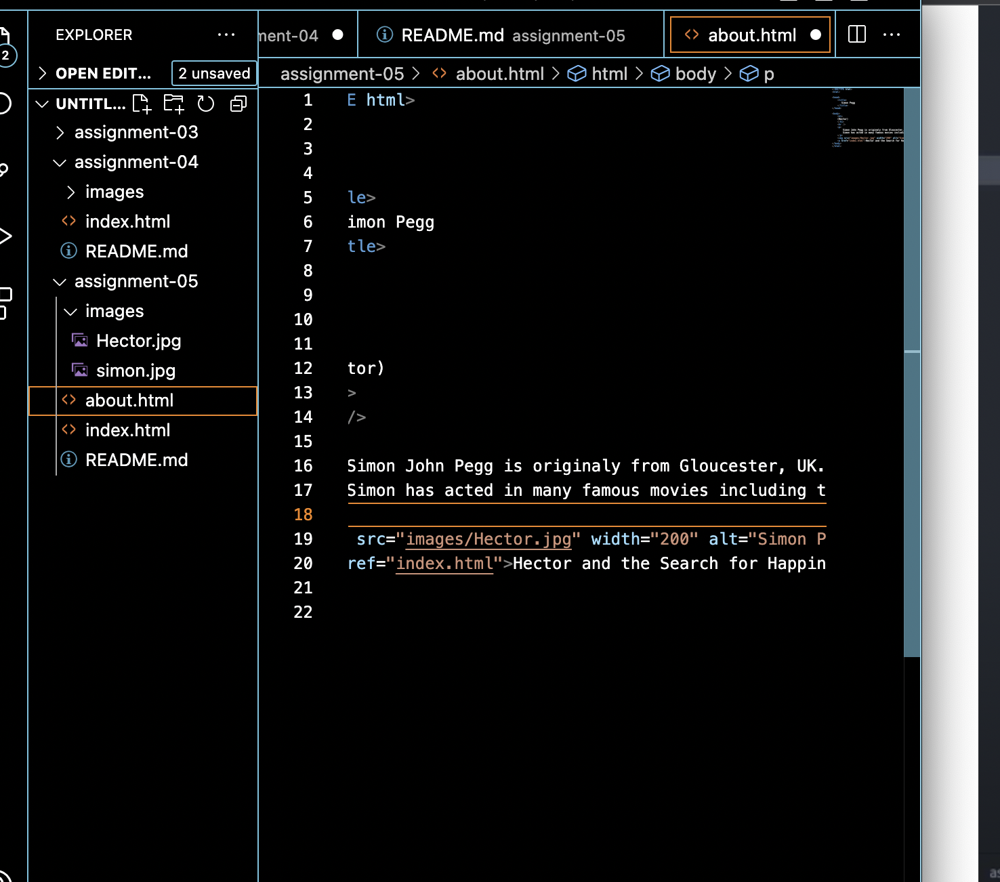

1. Using the Wayback Machine. I examiled Tesla over the years. Orginally the website was full of information with lots of links and overall information about the company and what they did. Tohis version of the website was from 2007. Todays version of the website is clean, consise, and simple. It is easy to navigate, does not have too much information to try and comprehend, yet is very helpful.
2. 