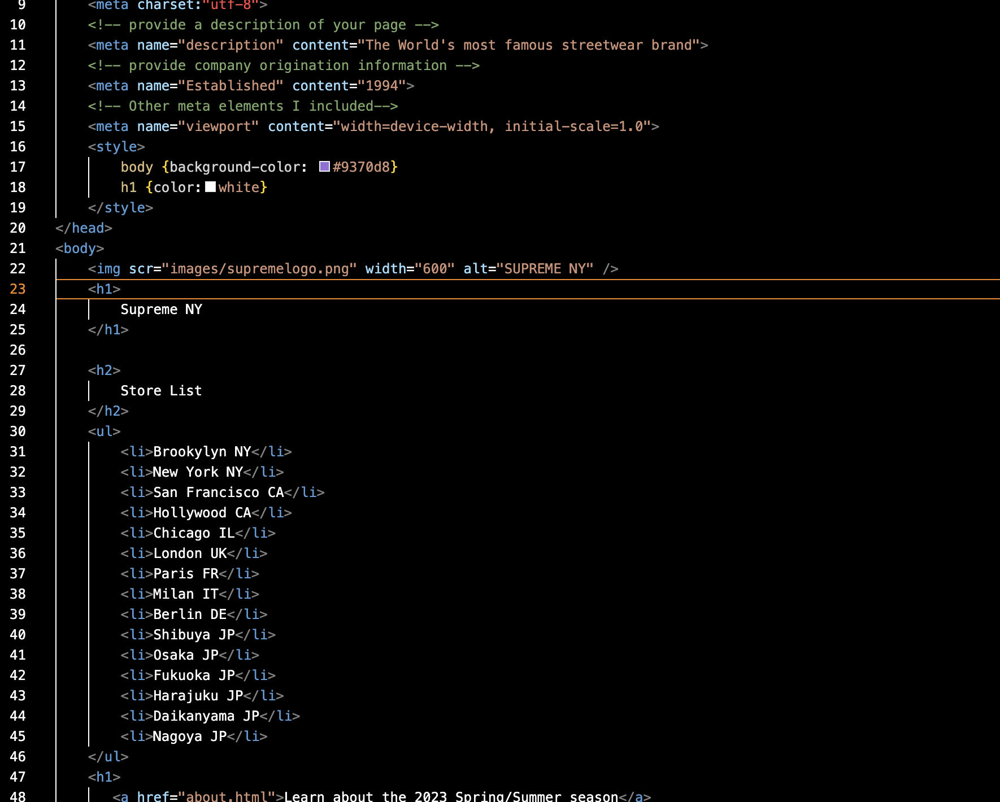

1. The main difference between semantic and structural elements is that the structural elements explain the relationships of information to other elements of information on the same page. Semantic elements on the other hand descrive the purpose of an element.
2. 