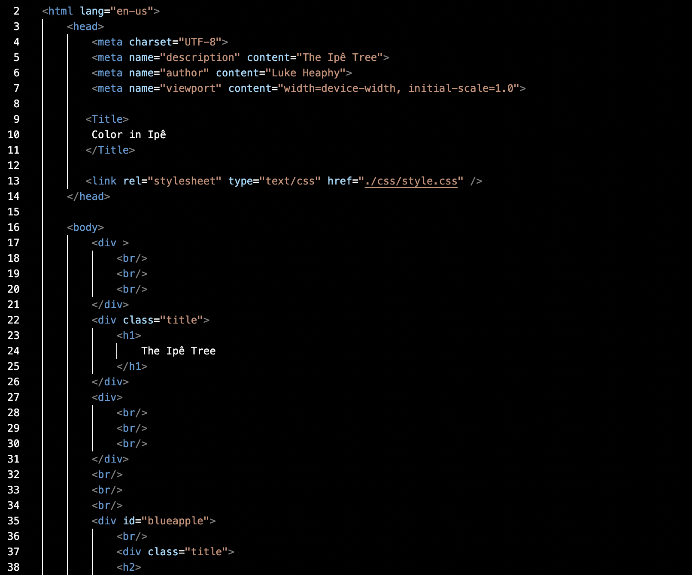

1. The different refrences you cann make in the style.css document are beyond helpful. You can be super broad and select everything with the universal function. The element will allow you to select any element that you match it with. A class will let you select a specific group of divs that you want to follow the given formatting. And the ID is very specific to the div that has the given name. Depending on what you want your website to exactly to look like will determing which ones you use. You dont want them to be all completely different but at the same time you want to break your website up to look a little differetly throughout.
2. I chose my colors because I find the Ipe tree to be extremely pretty and the vibrant yellow that the tree posesses really catches a persons eye and that is what I wanted to do with my website.
