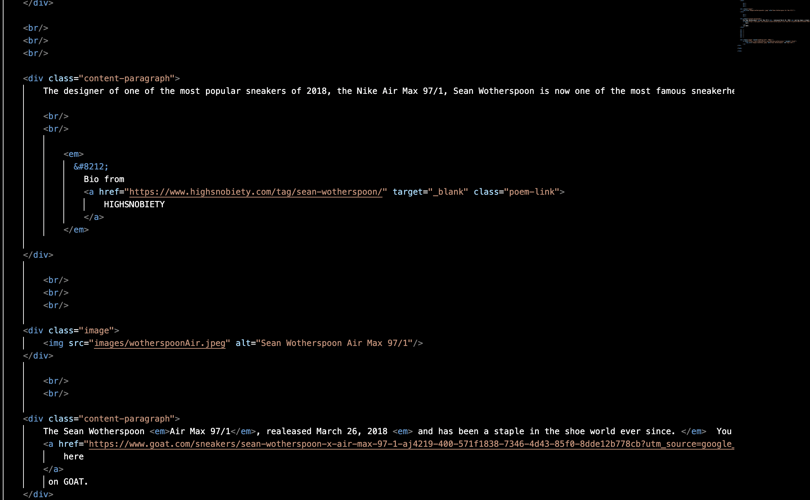

What is typography?
Typography is the style or the appearance of something. This is a common thing people subconsiously analyze with just about every phyisical object or piece of information in their life. Fonts and colors are great examples of how this can be altered in a website.

What is the importance of having fallback fonts or a font stack?
It is great to have extra fonts so that you have a plethora to choose from. If the one you are using does not suit the project it is writing for, then you will have to retrieve a new font. Having them stored makes this process easy and stress free. Fun thing I found is Mac products automatically store fonts in a preinstalled application called font book.

What is the difference between a system font, web font, and web-safe font?
System font is the font that your device uses default when typing on any of the preinstalled applications. A web font is a font that can be used specifically for a website. These are the ones that make websites unique and differentiate the style of the website. A web-safe font is one that is used thorough common applications and search engines to ensure that there is no formatiing error regardless of the device being used.
